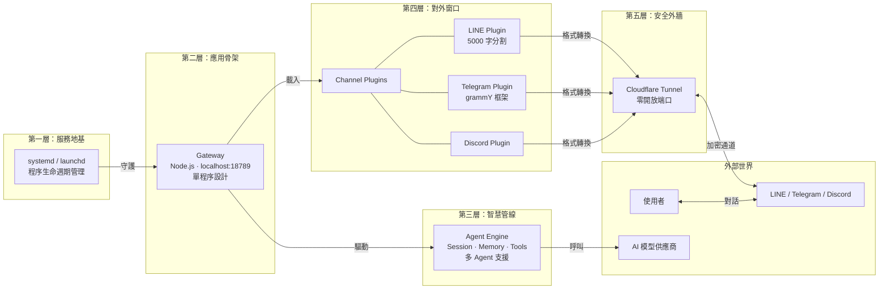
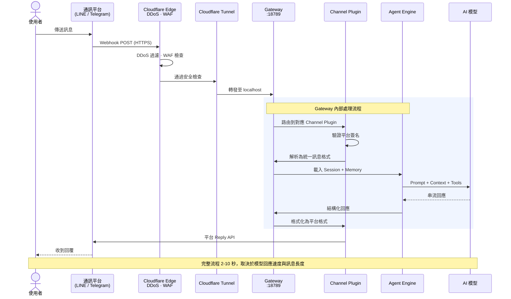

import { Callout } from 'fumadocs-ui/components/callout'

部署 AI Agent 不難，難的是讓它在生產環境活下來。

OpenClaw 的架構可以用一棟建築來理解：地基、骨架、管線、外牆、屋頂，五層各有分工。少了任何一層，整棟樓都撐不住。我們從外到內，逐層拆解。

## 五層架構

## 第一層：服務地基 — systemd / launchd

一棟建築的地基決定了它能承受多少震動。對 OpenClaw 來說，systemd（Linux）或 launchd（macOS）就是這個地基。

它做三件事：開機自動拉起 Gateway、程序崩潰後秒級重啟、統一收集所有日誌。沒有它，你的 Agent 會在某個凌晨三點默默斷線，而你隔天早上才發現。

<Callout type="warn">
如果你在 VPS 上手動用 `node` 或 `npm start` 啟動 Gateway，SSH 斷線的瞬間程序就會終止。務必透過 systemd 管理。
</Callout>

## 第二層：應用骨架 — Gateway

Gateway 是 OpenClaw 的承重結構，一個跑在 `localhost:18789` 的 Node.js 程序，負責接收所有請求、協調所有模組、回傳所有結果。

它的設計選擇很明確：**單程序、不分散**。不用 Docker，不用 Kubernetes，不搞微服務。所有邏輯跑在同一個 process 裡 — Webhook 接收、簽名驗證、Session 管理、AI 呼叫、回應格式化，全部在這裡完成。

這個選擇是刻意的。對個人部署或小團隊來說，維運一套分散式系統的成本遠高於它帶來的好處。單程序的 Gateway 讓你用 `journalctl` 就能看完所有日誌，用一個 systemd unit file 就能管理整個服務。

Gateway 同時內建了一個基於 Vite + Lit 的 Web 控制面板（Control UI），透過 WebSocket 連線提供即時狀態監控。設定檔採用 JSON5 格式，支援註解，對人類友善。

## 第三層：智慧管線 — Agent Engine

如果 Gateway 是骨架，Agent Engine 就是跑在裡面的水電管線 — 看不見，但少了它整棟樓無法運作。

Agent Engine 管理三個核心資源：

- **Session** — 每段對話的上下文。誰在說話、說了什麼、當前狀態，都在 Session 裡追蹤
- **Memory** — 跨 Session 的長期記憶。讓 Agent 記得使用者的偏好、歷史互動、重要資訊
- **Tools** — Agent 可以呼叫的外部能力，例如網路搜尋、檔案操作、瀏覽器自動化

每個 Agent 擁有獨立的 workspace 和模型設定。你可以同時運行多個 Agent，一個專門處理客服、一個負責技術問答、一個管理排程，彼此互不干擾。

## 第四層：對外窗口 — Channel Plugins

通訊平台之間的差異比你想像的大。LINE 不支援 Markdown、訊息上限 5,000 字元要自動分割；Telegram 用 grammY 框架，同時支援 long polling 和 webhook 兩種模式；Discord 有自己的 Embed 格式和 2,000 字元限制。

Channel Plugin 的工作就是把這些差異全部吞掉。對 Agent Engine 來說，它只需要產出純文字回應，Plugin 會負責處理平台特定的格式轉換、字數分割、API 認證。

這是一個典型的 Adapter Pattern：一組統一的內部介面，搭配多個平台專用的實作。要支援新平台，加一個 Plugin 就好，不需要動 Gateway 或 Agent Engine 的任何程式碼。

## 第五層：安全外牆 — Cloudflare Tunnel

這一層的設計原則只有一個：**你的伺服器不開放任何對外端口**。零。

Cloudflare Tunnel 是一條從你的伺服器主動建立的加密出站連線。外部的 Webhook 請求先抵達 Cloudflare 的邊緣節點，經過 DDoS 緩解和 WAF 過濾，再透過這條 Tunnel 轉發到你本機的 Gateway。

沒有 Tunnel 的替代方案意味著：你要自己管 SSL 憑證、開放 443 端口、設定防火牆規則、處理憑證續期。更關鍵的是，你的伺服器 IP 會直接暴露在網路上。

<Callout type="info">
OpenClaw 額外支援 Tailscale 整合，可以用 WireGuard-based 的 mesh VPN 做更細粒度的存取控制。搭配內建的 Token/密碼認證、dmPolicy（私訊策略）、groupPolicy（群組策略）和 Pairing 配對機制，構成多層防禦。
</Callout>

## 一則訊息的完整旅程

從使用者按下「傳送」到收到 AI 回覆，每一步都有明確的責任歸屬：

## GetClaw 觀點

這套架構看起來不花俏，因為它本來就不該花俏。

我們見過太多人把「部署 AI Agent」想得太簡單（丟上去就好）或太複雜（先搞一套 K8s 叢集）。OpenClaw 的五層架構是一個刻意的中間路線：足夠簡單讓一個人就能維運，足夠完整讓它在生產環境跑得穩。

單程序設計是爭議最大的選擇，但也是最務實的。你的 AI Agent 大概率不需要水平擴展 — 它需要的是不會在半夜斷線、出問題時能快速定位、更新時不用停機半小時。這些才是真正的生產環境需求。

Cloudflare Tunnel 的零端口策略不是偏執，是底線。在一個每天都有自動化掃描和漏洞利用的網路環境裡，少開一個端口就是少一個攻擊面。

如果你正在評估要不要自己架，問自己一個問題：你願意花多少時間在「讓 Agent 持續運作」這件事上？如果答案是「越少越好」，那這套架構的每個設計選擇都在為你省時間。
