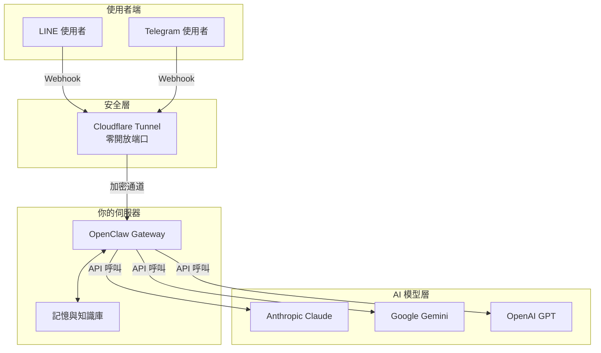

import { Callout } from 'fumadocs-ui/components/callout'

## 為什麼自架 AI Agent

把 AI Agent 交給 SaaS 平台，就像把公司的大腦寄放在別人的伺服器上 — 你付了月費，卻換來三個你遲早會踩到的問題。

第一，**資料離開你的手就不再是你的**。今天的隱私條款明天可以改寫，你的對話紀錄、內部知識庫、客戶互動資料，全都成了別人訓練模型的潛在養分。自架意味著每一筆資料從頭到尾都在你的機器上，零例外。

第二，**SaaS 的定價模型天生對重度使用者不利**。用量越大、付越多，而且漲價你只能被動接受。自架之後，你的固定成本就是一台機器和電費，變動成本只剩 AI 模型的 API 呼叫 — 這份指南會手把手教你把這筆錢壓到原本的三分之一。

第三，**你需要的不只是一個聊天機器人，而是一個你能完全掌控的系統**。選什麼模型、怎麼配 prompt、誰有權存取、什麼時候升級 — 這些決策應該在你手上，不是在供應商的 roadmap 上。

## 這份指南帶你走完全程

我們把整個設定流程拆成七個階段，每個階段都有明確的起點和終點。你可以一口氣讀完，也可以按需跳轉：

```
選硬體 → 安裝 OpenClaw → 設定架構 → 串接 LINE / Telegram → 學會操作介面 → 省錢策略 → 進階功能
```

**選硬體**：Mac mini、雲端 VPS、還是家裡那台退役的桌機？我們會幫你算清楚每個選項的長期成本和效能天花板。

**安裝 OpenClaw**：從作業系統準備到 OpenClaw 跑起來，每一步都有指令可以跟著做。

**設定架構**：Cloudflare Tunnel、反向代理、SSL — 讓你的 Agent 安全地暴露在公網上，同時不開放任何對外端口。

**串接 LINE / Telegram**：把 AI Agent 接進你團隊或客戶已經在用的通訊軟體，五分鐘內收到第一則回覆。

**學會操作介面**：Web Dashboard 看全局、Terminal TUI 做精細操作，兩套介面各有所長。

**省錢策略**：訂閱制 API Key、混合模型路由、快取機制 — 我們實測過的每一招都在這裡。

**進階功能**：記憶系統、多 Agent 協作、自動化排程 — 從「能用」走到「好用」的關鍵。

## 架構一覽



整體運作邏輯很直覺：使用者在熟悉的通訊軟體上發送訊息，Cloudflare Tunnel 把請求安全地導進你的伺服器，OpenClaw Gateway 根據設定選擇最合適的 AI 模型生成回應，再原路送回。你的伺服器不需要暴露任何對外端口，所有連線都是由內向外建立的加密通道。

## 誰適合這份指南

**技術創辦人**：你不想在 AI 基礎設施上被綁定，想親手評估自架的可行性和投入產出比。這份指南給你完整的技術全景和決策依據。

**企業 IT 團隊**：老闆說要導入 AI，你需要一份從硬體到部署到安全的完整方案，能直接拿去寫提案。這份指南就是你的起點。

**進階玩家**：你玩過各種 AI 工具，現在想自己掌控整個 stack。這份指南帶你從「用別人的服務」跨到「跑自己的基礎設施」。

你不需要是 DevOps 專家。能在終端機裡 `ssh` 到一台遠端機器、知道 `sudo` 是什麼意思，就夠了。

## 我們為什麼公開這份指南

GetClaw 團隊寫這份指南，不是因為我們覺得自架很簡單 — 恰好相反。

**起步簡單，做好需要經驗。** 裝一個 OpenClaw 跑起來，大概一個下午的事。但要讓它穩定運作不掉線、安全設定滴水不漏、API 費用壓到合理範圍、真正融入團隊的日常工作流 — 這些是我們踩了無數坑之後才累積出來的經驗。

我們選擇把這些經驗全部攤開來寫，是因為相信：**理解全貌的人，不管最後自己動手還是找專業團隊，都會做出更好的決定。**

<Callout type="info">
這份指南包含完整的逐步安裝指令與設定步驟 — 你可以從頭到尾跟著做，把整套系統架起來。我們的目標是讓你不只知道「怎麼做」，更理解「為什麼這樣做」。每一個設定背後的取捨和考量，我們都會說清楚。
</Callout>

## GetClaw 觀點

我們見過太多團隊花了兩週把 AI Agent 架起來，卻在第三個月因為帳單失控、安全事件、或維運負擔而放棄。技術上讓它「跑起來」只是起點，讓它「持續穩定地為組織創造價值」才是真正的挑戰。

這份指南把我們的實戰經驗毫無保留地交給你。如果你讀完之後決定自己來 — 你會少走很多彎路。如果你讀完之後決定讓 GetClaw 來 — 我們之間的對話會從「什麼是 Cloudflare Tunnel」直接跳到「你的業務需要什麼樣的 Agent 架構」。

無論哪條路，你都贏了。

準備好了嗎？從[硬體選擇](/docs/hosting/options)開始。
